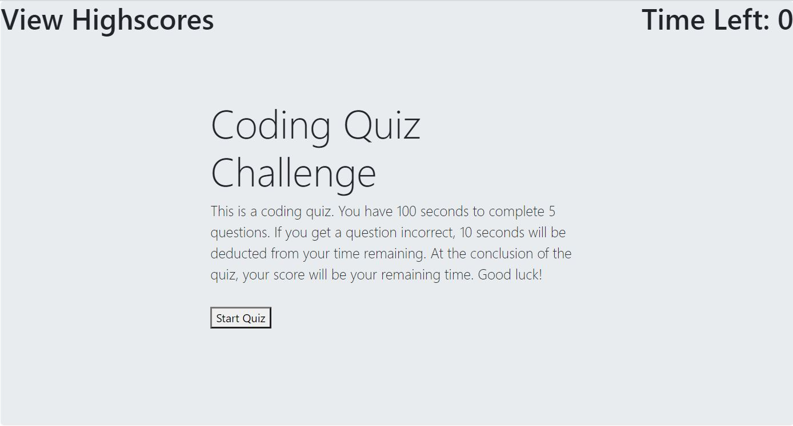

# Coding Quiz
UCI Boot Camp Homework 04 - Coding Quiz

This was the fourth homework assignment for the full stack web development program at UC Irvine, in which the goal was to build a timed code quiz that records scores. 

# Link to Deployed Application:
https://maxx105.github.io/coding_quiz/

# Image of Deployed Application:

# Technologies:
I used HTML and CSS as well as Bootstrap for the front end. The script is written using Javascript.

# How to Use:
When the user clicks the Start Quiz button, the timer starts counting down seconds from 100. There are five questions to answer and if you miss and answer, 10 seconds are deducted from the timer. Once the 5 questions are answers, it prompts you to enter your initials to submit your high score. Those scores are recorded and can either be cleared by clicking the "clear highscores" button or can be viewed at any time by clickin the "view highscores" text in the upper left.

# How it Works:
When the quiz is started, a questionCount variable counts up on each button press. That number tells which question and answers to populate (calls the specific function tied to each question count number). That start quiz button also initiates a timer that counts down from 100. The script looks for the right answer string values and if those are chosen, it appends a "Right!" message and if not, it appends a "Wrong!" message. The submit button at the end basically appends a list item with the users entered initials and their score (string interpolation). That info is stored in the local storage and is called again when the submit button or the view highscores buttons are pressed. This allows the user to store highscores for use when accesing them. The clear highscores button basically does a window.localStorage.clear(); which clears the local storage.

